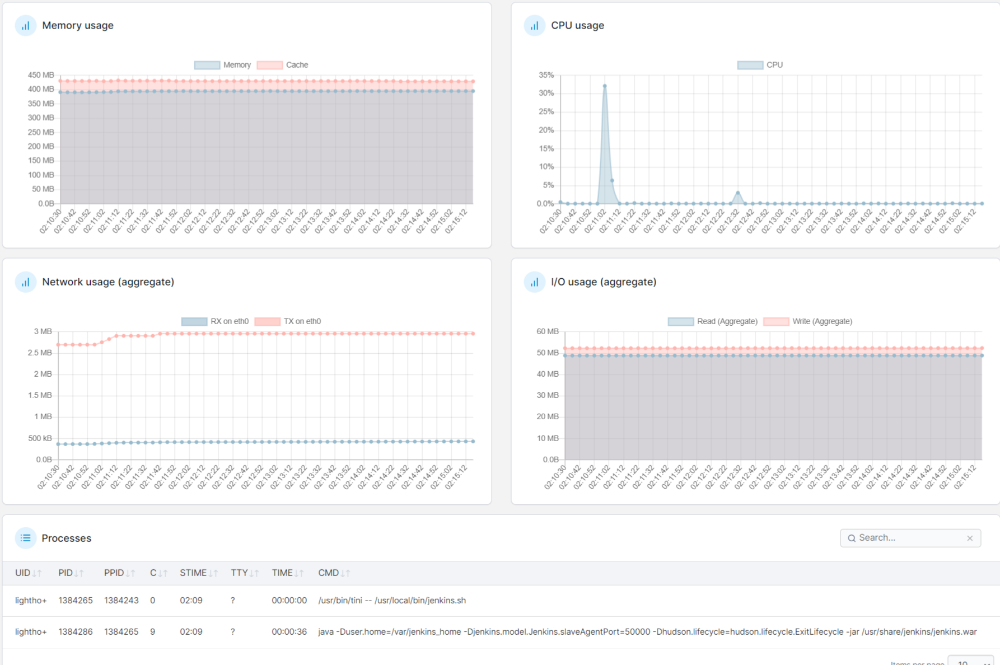
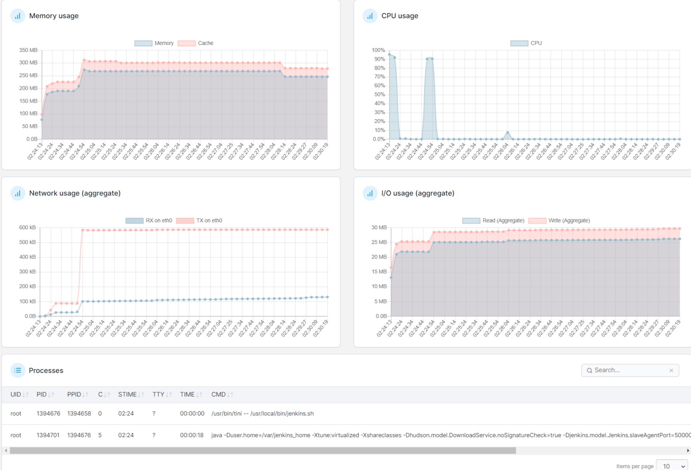

# Jenkins

## 说明
本镜像基于[jenkins/jenkins](https://hub.docker.com/r/jenkins/jenkins)进行个性化定制

更换了原始的jdk为[ibm-semeru-runtimes](https://hub.docker.com/_/ibm-semeru-runtimes)的openj9减少内存使用

修改时区为“中国/上海”，默认运行用户为root规避权限问题

添加了busybox、vim软件包

vim这玩意懂得都懂，连进容器改配置的大有人在，没这玩意会挨骂的。什么垃圾容器连个编辑器都没有！

busybox这玩意是用来支持一些shell的写法，比如说if [[ true == false]]之类的。

启动命令示例为

```shell
docker run -td -v jenkins_home:/var/jenkins_home -p 8080:8080 -p 50000:50000 --restart=on-failure makedie/jenkins:2.462.3-lts-jdk17-openj9-17.0.12.1_7-jdk
```

jenkins_home应改为具体的宿主机目录，你喜欢的话比如`/var/jenkins_home`这样也行

具体的tag应根据hub中自行选择，不应使用空或latest，应如上述`2.462.3-lts-jdk17-openj9-17.0.12.1_7-jdk`显式指定

推荐使用lts版本的Jenkins，tag中`2.462.3-lts-jdk17-openj9-17.0.12.1_7-jdk`意思是

使用了`2.462.3-lts-jdk17`作为底包，替换的openj9版本是`17.0.12.1_7-jdk`

其他没啥特别的了，可以参考[Jenkins官方的镜像文档](https://github.com/jenkinsci/docker/blob/master/README.md)

有啥想整的欢迎提[issues](https://github.com/GreenDamTan/DockerFile/issues)

## 路标

https://hub.docker.com/repository/docker/makedie/jenkins/tags

https://github.com/GreenDamTan/DockerFile/tree/main/Jenkins

## openj9与原版的内存对比
后续补充其他状态的Jenkins性能指标对比  
平时使用观察至少能节约35%的内存，但没有进行直接的同工况对比
### 启动5分钟
本图例为启动Jenkins开始，5分钟的内存占用图例

使用原版JDK的Jenkins  


使用openj9的Jenkins  


如图所示，openj9占用更少，对内存有限的运行环境更友好