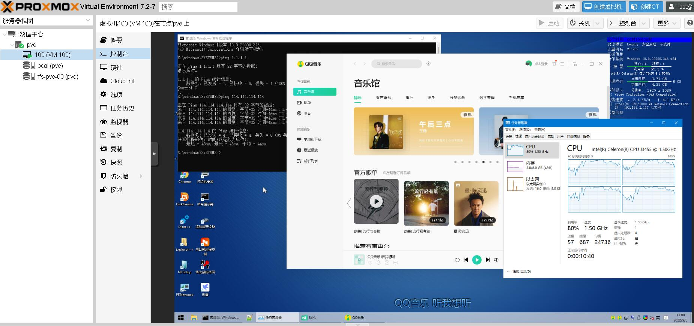
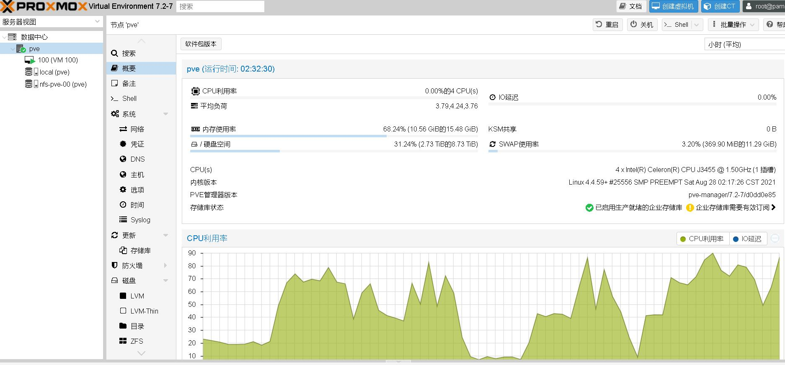
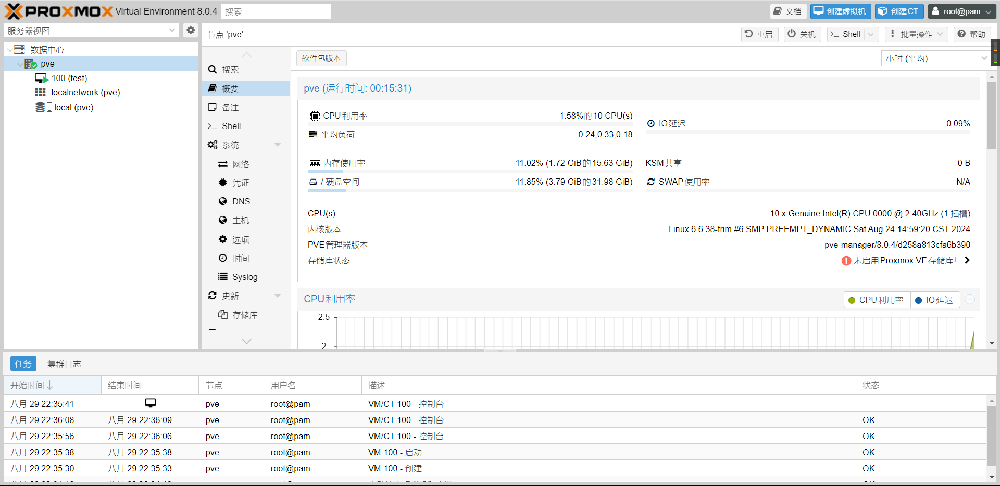

# 说明  
在docker里头跑Proxmox VE  
主要是给没kvm管理器但又有kvm的机器用  
可以部署在群辉之类的地方  
## 仓库地址  
### github
https://github.com/GreenDamTan/DockerFile/tree/dev/ProxmoxVE  
### docker hub
https://hub.docker.com/r/makedie/proxmox_ve
# 命令行  
这个[your_ip]你要换成你自己访问PVE的IP  
比如说`--add-host pve:192.168.1.2`  
```shell
docker run -idt \
--network host \
--privileged \
--name pve \
--add-host pve:[your_ip] \
--hostname pve \
makedie/proxmox_ve:7.2-1
```  
这个版本号你想用什么版本自己换  
https://hub.docker.com/repository/docker/makedie/proxmox_ve/tags

# 特殊行为说明
## ovs相关
若将宿主机的/var/run/openvswitch挂载入容器/host/var/run/openvswitch
且宿主机存在名称带ovs字样的网桥，可自动进行部分ovs-bridge配置

# 运行案例  
## 群辉  




## fnOS

